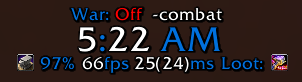

# Datatexts

This addon displays many useful things, like the current time, your loot spec or your equipped gears repair status. It originated from a quite practical WeakAura, which I got shared from a guild member. I was never able to track down the 100% original WeakAura because there are simply too many versions of this WeakAura floating around on Wago.

That being said I want full disclosure that, even though I fixed some of the broken API calls when they were changed at the start of Shadowlands, I have copied much of the logic code from said WeakAura and is not actually authored by me.

## Installation

This addon is officially available from [its Wago Addons page](https://addons.wago.io/addons/datatexts), as well as through [GitHub releases](https://github.com/JP1998/Datatexts/releases). Furthermore you can download the source code directly from [the GitHub repository](https://github.com/JP1998/Datatexts).

I've chosen these platforms because they are the ones I personally use, and at this time I don't see a reason to create releases for other platforms, as there is no demand. Nonetheless, I understand some people also use WowInterface or CurseForge, so if you'd like me to create releases on any other addon platform please [create an issue on GitHub](https://github.com/JP1998/Datatexts/issues/new) and I'll look into it.

## Contribute

You are very welcome to contribute to this repository by cloning it and once you've made changes opening a pull request. I'll take a look at those changes as soon as I am able to.
